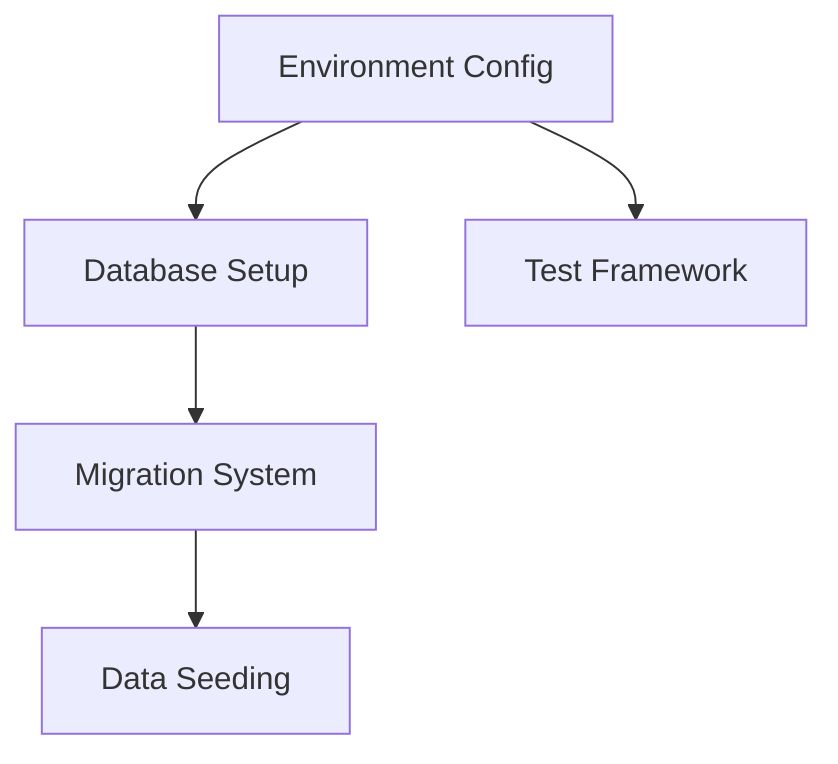
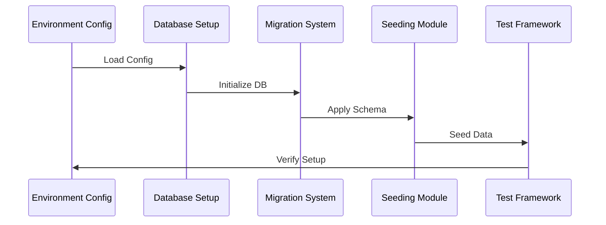
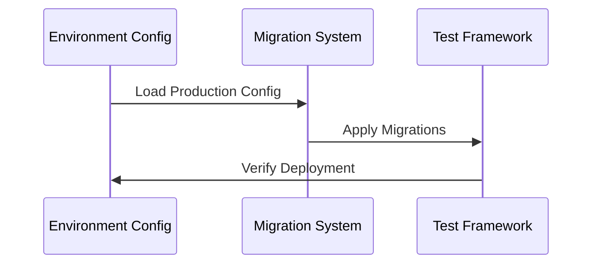

# Application Modules Documentation

## Overview
This document describes the core modules created during this session and how they interact with each other in the MediTracker Pro application.

## Module Architecture



## Core Modules

### 1. Environment Configuration Module
**Location**: `.env.*` files
**Purpose**: Manages environment-specific configurations

**Components**:
- Environment variable management
- Database connection settings
- Authentication configuration
- API endpoints configuration

### 2. Database Setup Module
**Location**: `scripts/setup-local-db.ts`
**Purpose**: Database initialization and configuration

**Features**:
- Database creation
- Extension setup
- Connection management
- Error handling

### 3. Migration System
**Location**: `scripts/migrate.ts`
**Purpose**: Database schema management

**Capabilities**:
- Schema versioning
- Up/down migrations
- Environment-specific migrations
- Migration logging

### 4. Data Seeding Module
**Location**: `scripts/seed-dev-data.ts`
**Purpose**: Development data management

**Data Models**:
```typescript
interface TestMapping {
  name: string;
  mappings: JsonB;
  is_in_use: boolean;
}

interface IngestionData {
  name: string;
  type: string;
  record_count: number;
  file_size_bytes: number;
  mapping_id: string;
}

interface ClaimsDummy {
  claim_id: string;
  patient_id: number;
  diagnosis_code: string;
  procedure_code: string;
  admission_date: Date;
  discharge_date: Date;
  total_charges: number;
  ingestion_id: string;
}

interface FilterGroup {
  name: string;
  description: string;
  user_id: string;
}
```

### 5. Testing Framework
**Location**: `scripts/test-db.ts`
**Purpose**: Database connectivity and functionality testing

**Capabilities**:
- Connection testing
- Schema verification
- Query testing
- Environment validation

## Module Interactions

### Development Flow


### Production Flow


## Dependencies Between Modules

### Direct Dependencies
- Environment Config → All Modules
- Database Setup → Migration System
- Migration System → Data Seeding
- All Modules → Testing Framework

### Shared Resources
- Database connection pool
- Environment variables
- Schema definitions
- Test data templates

## Configuration Management

### Development
```typescript
{
  database: {
    host: 'localhost',
    port: 5432,
    name: 'claims_db_dummy'
  },
  logging: 'debug',
  seeding: true
}
```

### Production
```typescript
{
  database: {
    host: 'neon.tech',
    port: 5432,
    name: 'neondb'
  },
  logging: 'error',
  seeding: false
}
```

## Best Practices

### Module Development
1. Single Responsibility Principle
2. Environment awareness
3. Error handling
4. Logging
5. Testing

### Module Integration
1. Loose coupling
2. Clear interfaces
3. Error propagation
4. Resource management
5. Performance optimization

## Troubleshooting

### Common Issues
1. Environment mismatch
2. Database connection
3. Migration conflicts
4. Seeding errors

### Resolution Steps
1. Check environment
2. Verify connections
3. Review logs
4. Test individually
5. Validate configuration

## Future Improvements

### Planned Enhancements
1. Module monitoring
2. Performance metrics
3. Automated testing
4. Documentation updates
5. Security hardening

### Scalability Considerations
1. Connection pooling
2. Cache implementation
3. Query optimization
4. Load balancing
5. Backup strategies