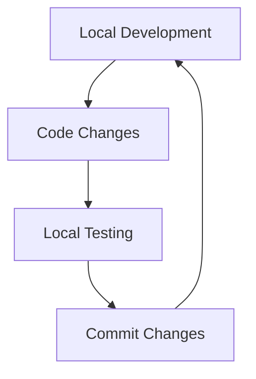
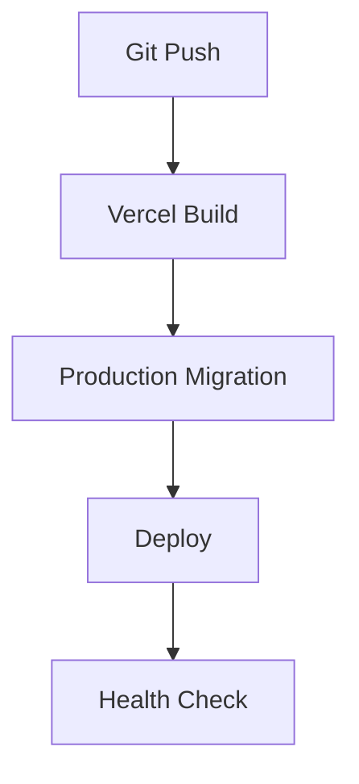

# Development and Deployment Workflow

## Overview
This document outlines the development and deployment workflow for the MediTracker Pro application, including local development setup, testing procedures, and production deployment.

## Local Development Workflow

### 1. Initial Setup
```bash
# Install dependencies
npm install

# Set up local environment
npm run dev:fresh
```

### 2. Development Cycle


### 3. Database Operations
- **Fresh Start**: `npm run dev:fresh`
- **Update Schema**: `npm run migrate:dev`
- **Reset Test Data**: `npm run seed:dev`

## Production Deployment

### 1. Vercel Deployment


### 2. Database Operations
- **Production Migration**: `npm run migrate:prod`
- **Connection Test**: `NODE_ENV=production npm run test:db`

## Environment Management

### Development Environment
- Local PostgreSQL database
- Development environment variables
- Test data seeding
- Debug logging enabled

### Production Environment
- Neon PostgreSQL database
- Production environment variables
- No test data
- Optimized logging

## Directory Structure
```
/
├── scripts/               # Database management scripts
├── .env.development      # Development environment variables
├── .env.production       # Production environment variables
└── .env.local           # Shared environment variables
```

## Testing Strategy

### Local Testing
1. Unit tests
2. Integration tests
3. Database operations
4. API endpoints

### Production Testing
1. Migration dry runs
2. Connection verification
3. Health checks
4. Performance monitoring

## Deployment Checklist

### Pre-deployment
- [ ] All tests passing
- [ ] Migrations tested locally
- [ ] Environment variables configured
- [ ] Dependencies updated

### Post-deployment
- [ ] Database migration successful
- [ ] API endpoints responding
- [ ] Monitoring active
- [ ] Logs verified

## Troubleshooting Guide

### Local Development Issues
1. Check PostgreSQL service
2. Verify environment variables
3. Clear node_modules
4. Reset database

### Production Issues
1. Check Vercel logs
2. Verify Neon connection
3. Review migration status
4. Check environment variables

## Best Practices

### Code Management
- Use feature branches
- Regular commits
- Descriptive commit messages
- Code review process

### Database Management
- Test migrations locally
- Backup before migration
- Monitor performance
- Regular health checks

### Security
- No credentials in code
- Environment separation
- Regular updates
- Access control

## Quick Reference

### Common Commands
```bash
# Development
npm run dev:fresh         # Fresh development setup
npm run migrate:dev      # Run development migrations
npm run seed:dev        # Seed development data

# Production
npm run migrate:prod    # Run production migrations
```

### Useful Links
- Vercel Dashboard: [Your Project URL]
- Neon Database Dashboard: [Your Database URL]
- Documentation: [Your Docs URL]
- Monitoring: [Your Monitoring URL]